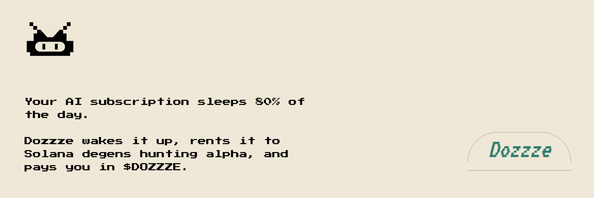

<p align="center">
  
</p>

<h1 align="center">DOZZZE</h1>

<p align="center">
  <a href="https://dozzze.xyz"></a>
  <a href="https://x.com/DOZZZEBOT"></a>
  <a href="https://github.com/DOZZZEBOT/DOZZZE"></a>
  <a href="https://pump.fun"></a>
</p>

<p align="center">
  <a href="./LICENSE"></a>
  <a href="https://opensource.org/licenses/Apache-2.0"></a>
  <a href="https://nodejs.org">=22"></a>
  <a href="https://www.typescriptlang.org"></a>
  <a href="https://solana.com"></a>
  <a href="./package.json"></a>
  <a href="https://ghcr.io/dozzzebot/dozzze-coord"></a>
</p>

<p align="center">
  <a href="./docs/quickstart.md">Quickstart</a> ·
  <a href="./docs/architecture.md">Architecture</a> ·
  <a href="./docs/deployment.md">Deployment</a> ·
  <a href="./CONTRIBUTING.md">Contributing</a>
</p>

---

## Overview

DOZZZE is an open-source mesh that turns idle consumer AI compute into a
market. On one side: anyone paying for Claude Pro, ChatGPT Plus, a
beefy local GPU running Ollama / LM Studio, or sitting on unused API keys.
On the other side: traders and builders who need cheap, parallel LLM
calls to sift Solana memecoin flow, scan Discord alpha, summarize on-chain
activity, or drive their own consumer apps.

The node you run is a self-custodial, local-first worker. It talks only
to your own runtime, polls a coordinator you trust, and accrues `$DOZZZE`
credits for every job it completes. Treasury operators batch-distribute
the token on-chain from a pump.fun mint. No custody, no KYC, no SaaS
middle layer.

Everything in this repo is Apache 2.0. Fork it, self-host it, extend it.

## How it works

```
    ┌──────────────────────┐         ┌──────────────────────────┐
    │  Consumer            │ POST    │   @dozzze/coordinator    │
    │  (SDK / curl / bot)  │/submit ▶│   Hono + SQLite queue    │
    └──────────────────────┘         │   bearer-token auth      │
               ▲                     │   per-key rate limits    │
               │ GET /result/:id     │   long-poll support      │
               │                     │   accrual ledger         │
               │                     └────────┬─────────────────┘
               │                     GET      │   POST
               │                    /poll     │  /report
               │                              ▼
               │                     ┌──────────────────────┐
               │                     │   @dozzze/node       │
               │                     │   router + worker    │
               │                     │       │              │
               │                     │       ▼              │
               │                     │   Ollama / LM Studio │
               │                     │   BYOK endpoints     │
               │                     │       │              │
               │                     │       ▼              │
               │                     │   (optional)         │
               │                     │   Solana devnet memo │
               │                     └──────────────────────┘
               │
               │                      ┌──────────────────────┐
               └──────────────────────│   Treasury operator  │
                                      │   dozzze-coord       │
                                      │   distribute --mint  │
                                      └──────────┬───────────┘
                                                 ▼
                                      Solana mainnet SPL transfer
                                      to every node's wallet
```

A job lives as a single `Job` JSON object from submission to settlement.
It carries a model name, a prompt, a max-token cap, and a payout in base
`$DOZZZE` units. The worker returns a `Result` containing the model
output, real token counts, and the node's wallet address. The coordinator
credits that address in a SQLite ledger and exposes `/balance/:address`
for public inspection. When the operator runs `distribute`, every
outstanding row becomes an on-chain SPL transfer and flips to `paid`.

## Packages

| Package | Purpose |
|---|---|
| [`@dozzze/sdk`](./packages/sdk) | Zod schemas shared across every component. This is the protocol. |
| [`@dozzze/client`](./packages/client) | Consumer SDK. `submit`, `getResult`, `awaitResult`, `submitAndAwait`. Works in Node and in the browser. |
| [`@dozzze/coordinator`](./packages/coordinator) | Hono HTTP broker. FIFO queue, SQLite persistence, bearer auth, per-key rate limiting, long-poll, accrual ledger, batch SPL distribution. |
| [`@dozzze/node`](./packages/node) | Worker + CLI. Detects Ollama and LM Studio, polls a coordinator, optionally memoes every result on Solana devnet, ships a `dozzze ask` consumer command. |
| [`examples/discord-bot`](./examples/discord-bot) | Reference consumer — a Discord slash-command bot built on `@dozzze/client`. Copy it, rebrand it, ship it. |

## Install

### Unix one-liner

```bash
curl -fsSL https://raw.githubusercontent.com/DOZZZEBOT/DOZZZE/main/scripts/install.sh | sh
dozzze doctor
dozzze wallet create
dozzze start
```

Piping curl to sh is a known pattern with known risks. Read the script
first — it is deliberately short: [`scripts/install.sh`](./scripts/install.sh).

### From source (any OS, including Windows)

```bash
git clone https://github.com/DOZZZEBOT/DOZZZE.git
cd DOZZZE
npm install
npm run build
npm run dozzze -- doctor
npm run dozzze -- wallet create
npm run dozzze -- start
```

> **Windows users:** the one-liner expects a POSIX shell. Use the from-source
> path above, or run the installer under WSL.

## Running a node

Every tick (default 30 s) the node pulls a job from the coordinator (or
fires a mocked one if `coordinator.mode` is `mock`), dispatches it to your
local runtime, and posts the result back. The coordinator credits your
wallet address in its ledger. Nothing leaves your machine except the
job result and the wallet address on it.

### CLI

```
dozzze start                           # boot the node
dozzze stop                            # SIGTERM the running node
dozzze status                          # one-shot health summary
dozzze doctor                          # deeper env check (runtimes, RPC, wallet)
dozzze config [show|get|set|path]      # inspect / edit ~/.dozzze/config.json
dozzze wallet [create|show|import|verify]
dozzze ask "<prompt>"                  # submit a prompt as a consumer and print the result
dozzze --help
```

### Switching from mock to a real coordinator

```bash
dozzze config set coordinator '{"mode":"http","url":"http://127.0.0.1:8787"}'
dozzze config set coordinator.apiKey "<bearer-token>"
dozzze start
```

## Running a coordinator

### Docker (recommended for production)

Prebuilt images are published to GHCR on every push to `main`:

```bash
docker volume create dozzze-coord

docker run -d --name dozzze-coord -p 8787:8787 \
  -v dozzze-coord:/data \
  -e DOZZZE_COORD_API_KEYS=<comma-separated-secrets> \
  -e DOZZZE_COORD_DB=/data/coord.sqlite \
  ghcr.io/dozzzebot/dozzze-coord:latest
```

Compose file lives at [`docker/docker-compose.yml`](./docker/docker-compose.yml).

### From source

```bash
npm run build
npm run coord                                               # dev, in-memory
dozzze-coord --port 8787 --host 127.0.0.1                   # local
dozzze-coord --db /var/lib/dozzze/coord.sqlite              # persistent queue
DOZZZE_COORD_API_KEYS=k1,k2 dozzze-coord --host 0.0.0.0     # public bind + auth
```

Binding to `0.0.0.0` without `DOZZZE_COORD_API_KEYS` set prints a loud
warning to stderr and refuses to start. The coordinator is in-memory only
unless you pass `--db`.

### Endpoints

```
POST /submit              submit a job (bearer auth)
GET  /poll/:nodeId        long-poll a job for this node
POST /report              deliver a Result back to the coordinator
GET  /result/:jobId       fetch a completed Result
GET  /balance/:address    public: accrued / paid / outstanding for a wallet
GET  /health              liveness
```

## Consumer SDK

`@dozzze/client` is an isomorphic TypeScript client. Works in Node 22+
and in any modern browser runtime.

```ts
import { DozzzeClient } from '@dozzze/client';

const client = new DozzzeClient({
  url: 'https://coord.example.com',
  apiKey: process.env.DOZZZE_COORD_API_KEY!,
});

// fire-and-forget + poll
const { jobId } = await client.submit({
  model: 'llama3.2',
  prompt: 'What is DOZZZE?',
  payout: 0.01,
});
const result = await client.getResult(jobId);

// or block until ready, with a timeout
const awaited = await client.submitAndAwait(
  { model: 'llama3.2', prompt: 'What is DOZZZE?', payout: 0.01 },
  { timeoutMs: 60_000 },
);
console.log(awaited.output);
```

Every method is schema-validated through `@dozzze/sdk` so the consumer
and the coordinator never drift. Breaking changes bump
`PROTOCOL_VERSION` in [`packages/sdk/src/protocol.ts`](./packages/sdk/src/protocol.ts).

## Running a full mesh locally

```bash
# Terminal A — coordinator
npm run build
npm run coord

# Terminal B — a node
npm run dozzze -- config set coordinator '{"mode":"http","url":"http://127.0.0.1:8787"}'
npm run dozzze -- wallet create
ollama serve                                 # in its own terminal
npm run dozzze -- start

# Terminal C — a consumer
curl -X POST http://127.0.0.1:8787/submit \
  -H 'content-type: application/json' \
  -d '{"protocolVersion":1,"kind":"completion","model":"llama3.2","prompt":"Hello","payout":0.01}'

# fetch the result the node produced
curl http://127.0.0.1:8787/result/<jobId>
```

Or run the scripted end-to-end demo (no Ollama required, coordinator +
curl only). Needs `jq` on PATH:

```bash
bash scripts/demo.sh
```

## Token distribution

`$DOZZZE` lives on Solana, launched via pump.fun. Accrual is off-chain
and atomic; distribution is on-chain and batched. This matches pump.fun's
"the operator never controls the mint" reality — the mint belongs to the
bonding curve (or to the AMM after graduation). The operator only holds
tokens they've bought and signs the transfers.

**Contract address: `TBA`** — posted here and on [dozzze.xyz](https://dozzze.xyz)
the moment the pump.fun launch is live. Any address claiming to be
`$DOZZZE` before that is not `$DOZZZE`.

### Flow

1. **Nodes accrue.** On every successful `/report`, the coordinator credits
   the node's wallet address in a SQLite ledger. The response echoes the
   base units added that tick via a `credited` field. Nothing moves
   on-chain per job.
2. **Anyone can check.** `GET /balance/:address` is public; returns
   `{ accrued, paid, outstanding }` for any wallet that has ever reported
   work.
3. **Operator distributes.** When the treasury holds `$DOZZZE` (bought
   from the bonding curve or the post-graduation AMM), the operator runs:

```bash
# 1:1 — send exactly the accrued base units to each address
dozzze-coord distribute \
  --mint <CA> \
  --treasury-keypair ./treasury.json \
  --cluster mainnet-beta \
  --db /var/lib/dozzze/coord.sqlite

# proportional — split a fixed pool across everyone by their share
dozzze-coord distribute \
  --mint <CA> \
  --treasury-keypair ./treasury.json \
  --cluster mainnet-beta \
  --db /var/lib/dozzze/coord.sqlite \
  --pool 1000000000      # 1,000 $DOZZZE at 6 decimals, for example
```

Always pass `--dry-run` first to preview the transfers. The command
creates missing recipient ATAs on the fly (paid for by the treasury's
SOL), chunks transfers to fit under Solana's transaction size budget,
waits for `confirmed`, and flips each ledger row to `paid` only after
on-chain confirmation. Reruns are safe — already-paid amounts are skipped.

## Optional: devnet settlement on the node

Independent of the treasury distribution above, a node can memo every
`Result` on Solana devnet as a `dozzze:v1:...` proof-of-work string.
This is the "my node did this work" credential, verifiable from any
block explorer. It is off by default.

```bash
dozzze config set settlement '{"enabled":true,"cluster":"devnet"}'
dozzze wallet create
# either paste the password at the `dozzze start` prompt,
# or export DOZZZE_WALLET_PASSWORD=... for unattended runs
dozzze start
```

Each settled Result carries a `settlementTx` signature in the payload
the coordinator stores, so consumers can verify on-chain independently.

## Configuration

Config lives at `~/.dozzze/config.json` (override the root with
`DOZZZE_HOME=/some/path`). It's a zod-validated JSON file — safe to
hand-edit; the schema will tell you if you break it.

| Key | Default | Notes |
|---|---|---|
| `nodeId` | `NODE #0069` | Human label, shown in logs. Must match `/^NODE #\d{4}$/`. |
| `cluster` | `devnet` | `devnet` \| `testnet` \| `mainnet-beta`. Used by `doctor` and settlement. |
| `ollamaUrl` | `http://127.0.0.1:11434` | Local Ollama endpoint. |
| `lmStudioUrl` | `http://127.0.0.1:1234` | Local LM Studio endpoint. |
| `pollIntervalMs` | `30000` | Coordinator poll cadence. |
| `requireWallet` | `true` | If `false`, the node starts without a keystore and cannot settle. |
| `coordinator.mode` | `mock` | `mock` for offline dev, `http` for a real broker. |
| `coordinator.url` | — | Required when mode is `http`. |
| `coordinator.apiKey` | — | Bearer token sent on every coordinator call. |
| `settlement.enabled` | `false` | Memo every Result on Solana. |
| `settlement.cluster` | `devnet` | Cluster used for settlement. |
| `dailyBudgetUsd` | `0` | Soft cap for BYOK routing. |

## Paths

All node state lives under `~/.dozzze/`:

```
~/.dozzze/
├── config.json       # editable
├── keystore.json     # scrypt + AES-256-GCM encrypted Solana keypair — NEVER commit
├── dozzze.pid        # PID of the running node (removed on clean shutdown)
└── dozzze.log        # reserved; node logs to stdout
```

## Security

- **Keystore**: scrypt (`N=2^15, r=8, p=1`) + AES-256-GCM with an auth
  tag on every file. `wallet verify` round-trips a decrypt to confirm
  integrity. `wallet create` refuses to overwrite an existing keystore
  without explicit `y/N`.
- **Wallet unlock**: `dozzze start` does **not** unlock the keystore
  unless `settlement.enabled` is on. Unattended runs use
  `DOZZZE_WALLET_PASSWORD`.
- **Coordinator binding**: defaults to `127.0.0.1`. Binding to `0.0.0.0`
  requires `DOZZZE_COORD_API_KEYS` and prints a warning.
- **Auth**: bearer-token on `/submit`. Per-key rate limits sized for
  consumer apps, not brute-force.
- **Schema**: every wire message is zod-parsed on both sides.
- **Secrets**: `.gitignore` covers `~/.dozzze/` and `.env`. Never commit
  a keystore, mnemonic, or API key.
- This is a software wallet. Use it with amounts proportional to the
  trust you place in your own machine.

## Development

```bash
npm install
npm run typecheck
npm test
npm run build
npm run dozzze -- doctor     # run the CLI straight from source
```

Tests are colocated in `tests/` under each workspace. Every module has a
`.test.ts`. Use `vitest` in watch mode while iterating:

```bash
npm test -- --watch
```

CI runs lint, typecheck, tests, and a full build on every PR, and
publishes the coordinator image to GHCR on every push to `main`.

## Contributing

Read [`CONTRIBUTING.md`](./CONTRIBUTING.md) before opening a PR. In short:
conventional commits, tests with every change, strict TypeScript, no
`any`, no `@ts-ignore`, no undocumented dependency additions.

## License

<p>
  <a href="./LICENSE"></a>
  <a href="https://opensource.org/licenses/Apache-2.0"></a>
</p>

Released under the [Apache License 2.0](./LICENSE). Copy it, fork it,
break it, ship it. Don't rug people.

## Links

- **Website** — [dozzze.xyz](https://dozzze.xyz)
- **X** — [@DOZZZEBOT](https://x.com/DOZZZEBOT)
- **GitHub** — [DOZZZEBOT/DOZZZE](https://github.com/DOZZZEBOT/DOZZZE)
- **Pump.fun** — `TBA`
- **Docker image** — [ghcr.io/dozzzebot/dozzze-coord](https://ghcr.io/dozzzebot/dozzze-coord)
