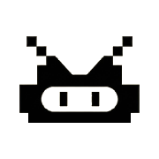

<p align="center">
  
</p>

# DOZZZE

> **Idle compute, awake.**
> Your AI subscription sleeps 80% of the day. DOZZZE wakes it up, routes the
> spare cycles to degens hunting alpha on Solana, and pays you in `$DOZZZE`.

[landing page](./index.html) · [quickstart](./docs/quickstart.md) · [architecture](./docs/architecture.md) · [deployment](./docs/deployment.md)

---

## What this repo is (today, v0.3)

Four workspaces plus an example:

- **`@dozzze/sdk`** — zod schemas shared by every component. Wire protocol lives here.
- **`@dozzze/client`** — consumer SDK. `submit`, `getResult`, `awaitResult`, `submitAndAwait`. Works in Node + browser.
- **`@dozzze/coordinator`** — Hono HTTP broker. FIFO queue, optional SQLite persistence, bearer-token auth, per-key rate limiting, long-poll support.
- **`@dozzze/node`** — the worker + CLI. Detects Ollama / LM Studio (both now usable as worker targets), polls a coordinator, optionally settles on Solana devnet, includes `dozzze ask` to act as a consumer from the shell.
- **`examples/discord-bot/`** — reference Discord consumer. Copy + deploy yourself.

v0.3 focus: everything a production coordinator needs (persistence, auth,
rate limits, deployable Docker image on GHCR) plus the SDK + example bot that
let anyone drive real jobs into the mesh. Token launch intentionally deferred.

See [`docs/architecture.md`](./docs/architecture.md) for the exact "live vs. missing"
list and the component map.

## Quick install (Unix-ish)

```bash
curl -fsSL https://raw.githubusercontent.com/DOZZZEBOT/DOZZZE/main/scripts/install.sh | sh
dozzze doctor
dozzze wallet create
dozzze start
```

**Piping-curl-to-sh is a known pattern with known risks.** Read the script
first: [`scripts/install.sh`](./scripts/install.sh). It is deliberately short.

## From source (any OS)

```bash
git clone https://github.com/DOZZZEBOT/DOZZZE.git
cd DOZZZE
npm install
npm run build
npm run dozzze -- doctor
npm run dozzze -- wallet create
npm run dozzze -- start
```

> **Windows users:** the `install.sh` one-liner does not run on cmd.exe or
> PowerShell. Use the "from source" path above, or run install.sh under WSL.

## What the node does

Every tick (default: 30s) the mocked coordinator emits a fake Job. Your node:

1. Reads the Job (model + prompt + max tokens).
2. Dispatches it to your local Ollama (`/api/generate`) or LM Studio.
3. Computes a mock payout (`(tokensIn + tokensOut) / 1000` in `$DOZZZE`).
4. Logs the result.

No network outbound except to your local runtime. No coordinator calls. No
chain calls (except a one-time `getHealth` in `dozzze doctor`, and only if
you're online).

## Commands

```
dozzze start              # boot the node
dozzze stop               # SIGTERM the running node
dozzze status             # one-shot health summary
dozzze doctor             # deeper env check
dozzze config             # show | get | set | path
dozzze wallet             # create | show | import | verify
dozzze ask "<prompt>"     # submit a prompt as a consumer; print the result
dozzze --help

# Coordinator
npm run coord             # dev (in-memory)
dozzze-coord --port 8787 --host 127.0.0.1
dozzze-coord --db /var/lib/dozzze/coord.sqlite        # persistent queue
DOZZZE_COORD_API_KEYS=k1,k2 dozzze-coord --host 0.0.0.0   # bearer auth + public bind
```

## Run a full mesh locally (v0.2)

```bash
# Terminal A — coordinator
npm run build
npm run coord

# Terminal B — a node
npm run dozzze -- config set coordinator '{"mode":"http","url":"http://127.0.0.1:8787"}'
npm run dozzze -- wallet create
ollama serve          # in a third terminal
npm run dozzze -- start

# Terminal C — a consumer
curl -X POST http://127.0.0.1:8787/submit \
  -H 'content-type: application/json' \
  -d '{"protocolVersion":1,"kind":"completion","model":"llama3.2","prompt":"Hello","payout":0.01}'

# fetch the result the node produced
curl http://127.0.0.1:8787/result/<jobId>
```

Or run the scripted end-to-end demo (no Ollama required, coordinator + curl only):

```bash
bash scripts/demo.sh   # needs jq on PATH
```

## Deploy the coordinator (Docker)

Prebuilt image published to GHCR on every push to `main`:

```bash
docker volume create dozzze-coord
docker run -d --name dozzze-coord -p 8787:8787 \
  -v dozzze-coord:/data \
  -e DOZZZE_COORD_API_KEYS=<your-secret-keys> \
  -e DOZZZE_COORD_DB=/data/coord.sqlite \
  ghcr.io/dozzzebot/dozzze-coord:latest
```

Or build from source:

```bash
docker build -t dozzze-coord -f docker/coordinator.Dockerfile .
```

## Use the SDK from your own code

```ts
import { DozzzeClient } from '@dozzze/client';

const client = new DozzzeClient({
  url: 'https://coord.example.com',
  apiKey: process.env.DOZZZE_COORD_API_KEY!,
});

const result = await client.submitAndAwait(
  { model: 'llama3.2', prompt: 'What is DOZZZE?', payout: 0.01 },
  { timeoutMs: 60_000 },
);
console.log(result.output);
```

## Build your own consumer

`examples/discord-bot/` is a reference Discord slash-command bot built on
`@dozzze/client`. Copy it, swap Discord for Telegram / web app / cron job —
the SDK is the same.

## Accrual + batch distribution (v0.4, pump.fun-compatible)

The flow built around pump.fun's "you don't control mint" reality:

1. **Nodes accrue.** On every successful `/report`, the coordinator credits
   the node's wallet in a SQLite ledger (`credited` field in the response
   shows base units added this tick). Nothing moves on-chain per job.

2. **Anyone can check.** `GET /balance/:address` is public; a node (or a
   user through a block explorer-style page) sees `{accrued, paid, outstanding}`.

3. **Operator buys + distributes.** When the operator has `$DOZZZE` in a
   treasury wallet (bought from the pump.fun bonding curve or post-graduation
   AMM), they run:

   ```bash
   # 1:1 — send exactly the accrued base units to each address
   dozzze-coord distribute \
     --mint <CA> \
     --treasury-keypair ./treasury.json \
     --cluster mainnet-beta \
     --db /var/lib/dozzze/coord.sqlite

   # or proportional — split this pool across everyone by their share
   dozzze-coord distribute \
     --mint <CA> \
     --treasury-keypair ./treasury.json \
     --cluster mainnet-beta \
     --db /var/lib/dozzze/coord.sqlite \
     --pool 1000000000          # 1,000 $DOZZZE at 6 decimals, for example
   ```

   Always `--dry-run` first to preview. The command creates recipient ATAs
   on the fly (paid for by the treasury's SOL), chunks transfers to fit
   under Solana's tx size budget, and marks each row `paid` after on-chain
   confirmation. Reruns are safe — already-paid amounts are skipped.

## Node-side Solana devnet settlement (optional, independent)

v0.2+ nodes can still memo every Result on devnet as a `dozzze:v1:...`
proof-of-work string — independent of the treasury distribution above. This
is the "my node did the work" credential. Off by default:

```bash
dozzze config set settlement '{"enabled":true,"cluster":"devnet"}'
dozzze wallet create
# either paste the password at the `dozzze start` prompt,
# or export DOZZZE_WALLET_PASSWORD=... for unattended runs
dozzze start
```

## Config

Lives at `~/.dozzze/config.json`. Safe to hand-edit (zod will tell you if you
break the schema). Relevant keys:

| Key | Default | Notes |
|-----|---------|-------|
| `nodeId` | `NODE #0069` | Human label, shown in logs. Must match `/^NODE #\d{4}$/`. |
| `cluster` | `devnet` | `devnet` \| `testnet` \| `mainnet-beta`. v0.1 only pings devnet in `doctor`. |
| `ollamaUrl` | `http://127.0.0.1:11434` | Local Ollama endpoint. |
| `lmStudioUrl` | `http://127.0.0.1:1234` | Local LM Studio endpoint. |
| `pollIntervalMs` | `30000` | Mock-coordinator tick. Set higher in dev if chatty. |
| `requireWallet` | `true` | If false, node starts without a keystore. Mock payouts only. |
| `coordinator.mode` | `mock` | Flipping to `http` errors out — v0.2 work. |

## Paths

All node state lives under `~/.dozzze/`. Override with `DOZZZE_HOME=/some/path`:

```
~/.dozzze/
├── config.json       # editable
├── keystore.json     # scrypt + AES-256-GCM encrypted Solana keypair — NEVER commit
├── dozzze.pid        # PID of the running node (removed on clean shutdown)
└── dozzze.log        # (not written in v0.1; reserved for v0.2)
```

## Security notes

- Keystore uses **scrypt (N=2^15, r=8, p=1)** + **AES-256-GCM**. Auth tag on
  every file. See [`docs/architecture.md`](./docs/architecture.md) §4.
- The node **does not** bind a public port in v0.1. The coordinator is
  in-process.
- Never commit `~/.dozzze/` or anything from it. `.gitignore` covers the root.
- This is not a hardware wallet. Use with devnet / testnet funds or small
  amounts only.

## Development

```bash
npm install
npm run typecheck
npm test
npm run build
# Run the CLI directly without a build:
npm run dozzze -- doctor
```

Tests are colocated in `packages/node/tests/`. Each module has a `.test.ts`.
Run `npm test -- --watch` during iteration.

## Contributing

Please read [`CONTRIBUTING.md`](./CONTRIBUTING.md) before opening a PR. TL;DR:

- Open-source only. No custody. No pre-sales.
- Conventional commits. Tests with everything. No `any`. No `@ts-ignore`.
- Honest docs. If a thing doesn't work yet, say so.

## License

[Apache 2.0](./LICENSE). Copy it, fork it, break it, ship it. Don't rug people.

## Links

- Website: [dozzze.xyz](https://dozzze.xyz) (when live) / [`./index.html`](./index.html)
- X: [@DOZZZEBOT](https://x.com/DOZZZEBOT)
- GitHub: [DOZZZEBOT/DOZZZE](https://github.com/DOZZZEBOT/DOZZZE)
